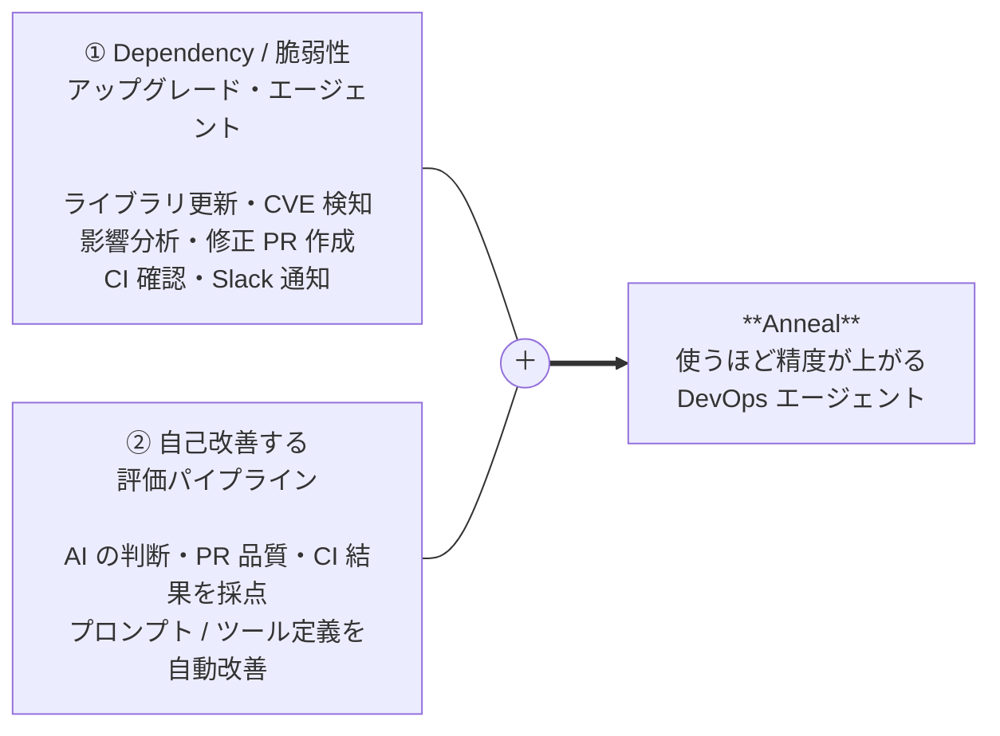
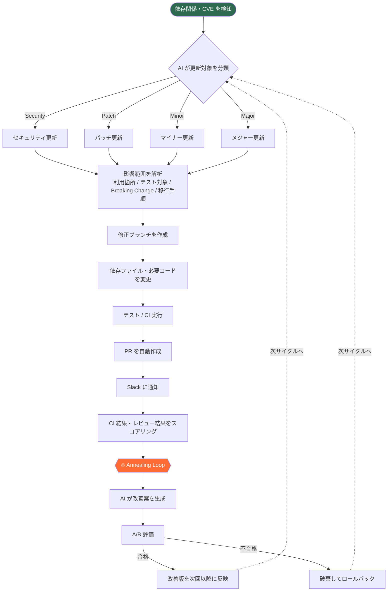
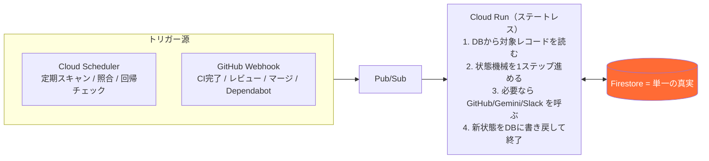
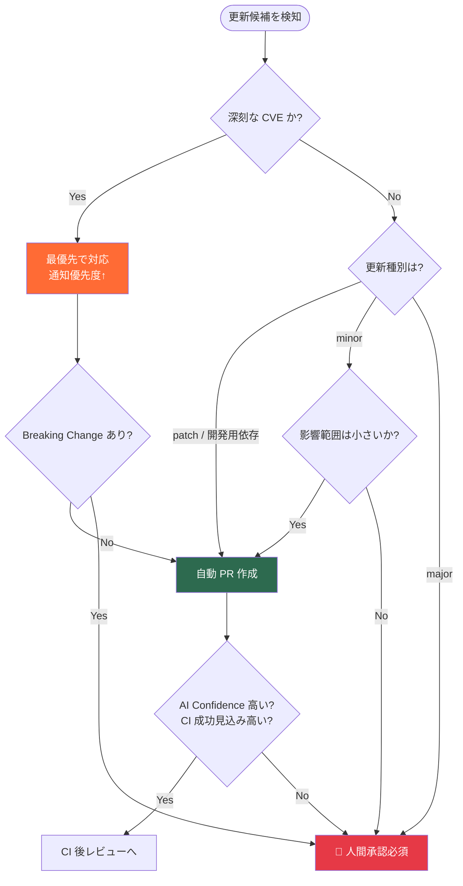
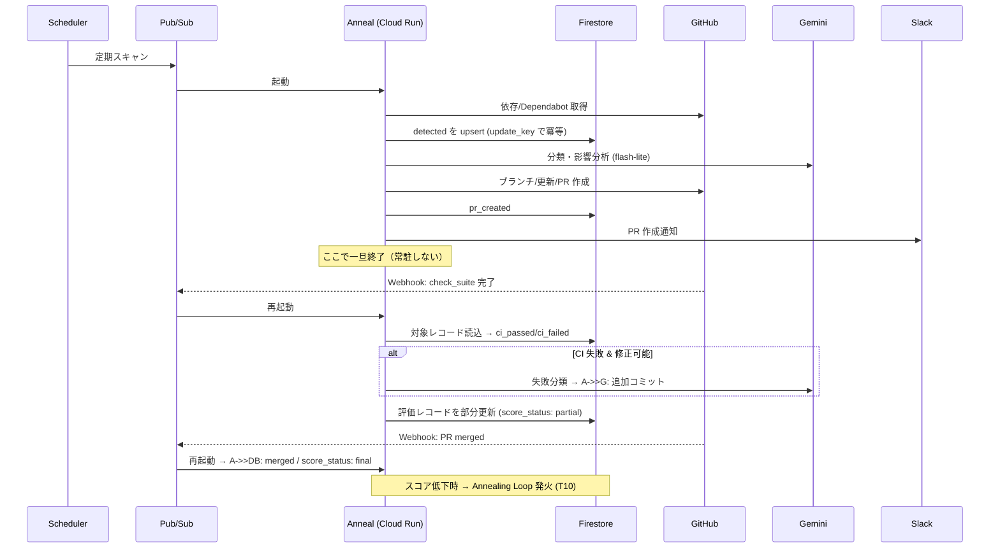
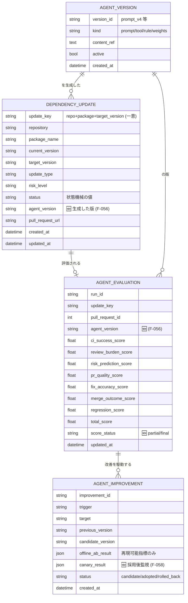
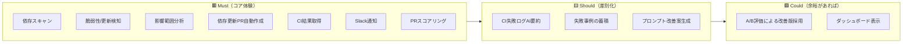

# Anneal — 要件定義書

> **Anneal（アニール / 焼きなまし）**
> 金属を加熱・徐冷して欠陥を取り除き、強くしなやかな状態へと整える熱処理。
> 本サービスは「依存ライブラリ・脆弱性」を更新して整え、さらに **エージェント自身も評価サイクルで“焼きなまし”続ける** ことに由来する。
>
> **Tagline:** *Refine your dependencies. Refine yourself.*

| 項目 | 内容 |
|---|---|
| プロダクト名 | **Anneal** |
| リポジトリ名（案） | `anneal` / `anneal-agent` / `anneal-core`（モジュール分割時） |
| 種別 | 自己改善型 Dependency / Security 更新エージェント（DevSecOps 支援） |
| ドキュメント | 要件定義書（v2・土台確定版） |
| 後続成果物 | 設計書（本書をベースに作成予定） |

---

## 1. 一言でいうと

> **「依存関係のアップグレードを AI が自律的に回し、その AI の振る舞い自体もスコアリングして自己改善し続けるエージェント」**



起点は2系統ある。**脆弱性起点（CVE / Dependabot）** と **メンテナンス起点（通常のバージョンアップ）** の両方で PR を作る。マージは人間承認が前提（無条件自動マージは対象外）。

---

## 2. 目的

| 区分 | 目的 |
|---|---|
| **主要目的** | 手作業の「依存更新・脆弱性対応・影響確認・PR 作成・CI 確認」を AI が代行し、保守運用コストを下げる |
| **副次目的** | AI の出力を定量評価し、失敗を学習材料に改善サイクルを回すことで、**使うほど精度が上がる**エージェントを実現する |

開発者は **重要な判断と承認だけ** を行えばよい状態を目指す。

---

## 3. 対象範囲（スコープ）

```mermaid
flowchart TB
    subgraph IN["✅ 対象に含める"]
        direction TB
        I1["依存関係監視<br/>package.json / requirements.txt 等"]
        I2["脆弱性検知<br/>Dependabot / OSV / npm audit / pip-audit"]
        I3["更新候補抽出<br/>patch / minor / major"]
        I4["影響範囲分析"]
        I5["修正 PR 作成 + 本文生成"]
        I6["CI 連携・結果監視"]
        I7["スコアリング"]
        I8["自己改善 + A/B 評価"]
        I9["Slack 通知"]
    end
    subgraph OUT["❌ 対象外"]
        direction TB
        O1["本番環境への自動デプロイ"]
        O2["インシデント / SRE 対応"]
        O3["Flaky Test 修復"]
        O4["独立したリリースノート生成<br/>※PR 本文生成は含む"]
        O5["無条件の自動マージ<br/>※MVP は人間承認必須"]
    end
```



---

## 4. 想定ユーザー

| ユーザー | 役割 |
|---|---|
| 開発者 | AI が作成した PR を確認・レビュー・マージ |
| Tech Lead | エージェントの判断品質・改善結果を確認 |
| SRE / DevOps | CI/CD・通知・運用設定を管理 |
| セキュリティ担当 | CVE 対応状況・優先度を確認 |
| 管理者 | 対象リポジトリ・通知先・実行権限を設定 |

---

## 5. 全体ワークフロー



> ⚠️ 上図は「概念フロー」。実体は1件あたり数分〜数日かかる**長時間・非同期プロセス**であり、そのまま直線実行はできない。誰が・いつ・何をきっかけに次へ進めるかは「6. 実行モデル」「7. 状態機械」「8. トリガー一覧」で確定させる。

---

## 6. 実行モデルとオーケストレーション 🆕

「ごちゃごちゃせずシームレスに流れるか」の土台。**ステートレスな実行基盤 + 永続ストアを単一の真実 + イベント駆動 + 定期照合** の組み合わせで担保する。

### 6.1 LLM（実行モデル）

| 項目 | 決定 |
|---|---|
| 既定モデル | **`gemini-2.5-flash-lite`**（最安。$0.10 / $0.40 per 1M tokens） |
| コスト最適化 | 非同期処理は **Batch API（50% 引き → $0.05 / $0.20）**、定型プロンプトは **Context Caching** を利用 |
| 無料枠 | Flash-Lite は無料枠あり（ハッカソンの開発・デモに十分） |
| モデル階層（任意） | 既定は全工程で最安モデル。`AI Confidence` が低い／メジャー更新など難所のみ上位モデルへ**エスカレーションするルーター**を将来オプションとして設計に残す（MVP は単一モデル） |

> ⚠️ 既定で最安モデルを使う方針のため、**「影響範囲分析」「コード修正」「自己改善案生成」は品質がぶれやすい**。これを補うのが本書のスコアリング＋自己改善ループであり、低品質出力は人間承認（11章）で必ず受け止める設計とする。

### 6.2 オーケストレーション方式：イベント駆動 + 定期照合（ハイブリッド）

Cloud Run はリクエスト/イベントごとに起動して消える（ステートレス）。よって**状態は必ず DB（Firestore）に持ち、毎回そこから読み出して状態機械を1ステップ進めて書き戻す**。「直線的に最後まで実行し続ける常駐プロセス」は持たない。



- **イベント駆動（主）**：GitHub Webhook で「CI が終わった」「レビューが付いた」「マージされた」を**即座に**次状態へ。→ シームレス・低コスト（無駄なポーリングなし）。
- **定期照合（保険 / Reconciliation）**：Webhook 取りこぼし・遅延に備え、Scheduler で「未完了レコード」を定期的に拾い、GitHub の実状態と突き合わせて整合させる。→ 堅牢性を担保。
- これにより「どのトリガーでも、対象レコードを読み込んで状態機械に従って1歩進めるだけ」という**単一の処理規律**に収束する。これが“ごちゃごちゃしない”理由。

---

## 7. 状態機械（Dependency Update Lifecycle）🆕

1件の依存更新が取りうる**全状態と遷移**を確定する。すべてのトリガー（8章）はこの図のいずれかの遷移を起こすだけであり、設計・実装の背骨になる。

```mermaid
stateDiagram-v2
    [*] --> detected: 検知 (scan / Dependabot)
    detected --> analyzing: 影響範囲分析を開始
    analyzing --> awaiting_approval: 人間承認必須と判定 (11.2)
    analyzing --> pr_creating: 自動PR作成OKと判定 (11.1)
    awaiting_approval --> pr_creating: 人間が承認
    awaiting_approval --> closed: 人間が却下
    pr_creating --> pr_created: ブランチ+変更+PR作成完了
    pr_created --> ci_running: CI起動
    ci_running --> ci_passed: CI成功
    ci_running --> ci_failed: CI失敗
    ci_failed --> fixing: 修正可能と分類 (F-024/025)
    fixing --> ci_running: 追加コミット→CI再実行
    ci_failed --> awaiting_review: 修正不能/高リスク (F-026)
    ci_passed --> awaiting_review: 人間レビューへ
    awaiting_review --> changes_requested: 指摘あり
    changes_requested --> fixing: 反映
    awaiting_review --> merged: マージ
    merged --> monitoring_regression: 回帰監視ウィンドウ開始
    monitoring_regression --> done: 問題なし
    monitoring_regression --> regressed: 不具合検知
    pr_created --> superseded: 新しい上位バージョン登場で置換
    detected --> superseded: 同一依存の上位候補に統合
    fixing --> on_hold: CI失敗が連続 (NF-009)
    on_hold --> awaiting_review: 人間判断へ
    note right of error
      どの状態からも例外時は error へ。
      リトライ可能(NF-007)・冪等(NF-021)
    end note
    detected --> error
    analyzing --> error
    pr_creating --> error
    done --> [*]
    closed --> [*]
    regressed --> awaiting_review: ロールバックPR等を人間へ
```

**状態一覧（status の取りうる値）**：`detected / analyzing / awaiting_approval / pr_creating / pr_created / ci_running / ci_passed / ci_failed / fixing / awaiting_review / changes_requested / merged / monitoring_regression / done / regressed / superseded / on_hold / closed / error`

### 7.1 冪等性・重複防止（土台）

| 項目 | 決定 |
|---|---|
| 一意キー `update_key` | `repository + package_name + target_version`（同一更新を一意に識別） |
| 重複検知の防止 | 同一 `update_key` の **アクティブなレコードが既にあれば新規作成しない**（NF-008 / F-008 系の実装根拠） |
| リトライ安全性 | すべての遷移は `update_key + 現在状態` を条件にした**冪等な書き込み**。再実行・Webhook 重複でも二重 PR を作らない（NF-007 と両立） |
| 上位版の出現 | 処理中に上位バージョンが出たら旧レコードを `superseded` にし、新 `update_key` に集約 |

---

## 8. トリガー一覧（正準）🆕

「どのトリガーで何が起き、状態がどう進むか」を一望する。**“監視する”とだけ書かれていた箇所に、起こし手（トリガー）と遷移を明示**した。

| # | トリガー源 | 種別 | 起動条件 | 状態遷移 | 関連要件 |
|---|---|---|---|---|---|
| T1 | Cloud Scheduler | 定期 | 設定間隔（例:毎時/毎日） | `[*]→detected` | F-001 |
| T2 | GitHub Dependabot Webhook | イベント | 新規アラート受信 | `[*]→detected`（優先度↑） | F-002, F-019 |
| T3 | （T1/T2 の後続） | 内部 | レコードが detected | `detected→analyzing→…` | F-006〜F-012 |
| T4 | GitHub Webhook `check_suite/check_run` | イベント | **CI 完了** | `ci_running→ci_passed/ci_failed` | F-021, F-022 |
| T5 | （T4 の後続） | 内部 | CI 失敗 | `ci_failed→fixing` or `→awaiting_review` | F-023〜F-026 |
| T6 | GitHub Webhook `pull_request_review` | イベント | **レビュー付与** | `awaiting_review→changes_requested/merged` | F-029 |
| T7 | GitHub Webhook `pull_request (closed,merged)` | イベント | **マージ/クローズ** | `awaiting_review→merged` / `→closed` | F-030 |
| T8 | Cloud Scheduler（回帰チェック） | 定期 | マージ後の監視ウィンドウ内 | `monitoring_regression→done/regressed` | Regression Score |
| T9 | Cloud Scheduler（照合 / 保険） | 定期 | 未完了レコードを走査 | 取りこぼし状態を実状態に同期 | NF-007, 6.2 |
| T10 | スコア確定後の内部判定 | 内部 | 直近 N 件のスコア低下等 | Annealing Loop 発火 | F-032, F-034 |

> **太字＝前版で“トリガー未定義”だった箇所**（CI 完了 / レビュー / マージ / 回帰）。すべて Webhook または Scheduler に割り当てて解消した。スコアリングはこれら**異なる時刻に届く入力（T4/T6/T7/T8）を受けて段階的に確定する**（→ 12.5 / 13章）。

---

## 9. 機能要件

要件 ID は設計書での追跡キーとして維持する。

### 9.1 依存関係・脆弱性検知（F-001〜F-006）

| ID | 要件 |
|---|---|
| F-001 | 対象リポジトリの依存定義ファイルを定期的にスキャンできる |
| F-002 | GitHub Dependabot Alert などの脆弱性情報を取得できる |
| F-003 | npm / Python / Go など主要エコシステムの依存情報を解析できる |
| F-004 | 更新候補を patch / minor / major に分類できる |
| F-005 | CVE がある場合、深刻度・影響バージョン・修正版バージョンを取得できる |
| F-006 | 更新優先度を AI が判定できる |

**優先度分類**：🔴 Critical（悪用可能 CVE / Exploit 公開 / 本番影響）/ 🟠 High（High 以上の CVE、広範囲依存）/ 🟡 Medium（通常 patch・minor）/ ⚪ Low（開発用・低頻度・破壊的変更の懸念大）

### 9.2 影響範囲分析（F-007〜F-012）

| ID | 要件 |
|---|---|
| F-007 | 更新対象ライブラリの利用箇所を検索できる |
| F-008 | import / require / 設定ファイル / CI 設定での利用を検出できる |
| F-009 | Breaking Change / Migration Guide の有無を確認できる |
| F-010 | 変更が必要なコード・テスト・設定を AI が推定できる |
| F-011 | 影響範囲を PR 本文に要約できる |
| F-012 | 変更リスクを Low / Medium / High で分類できる |

### 9.3 自動修正・PR 作成（F-013〜F-020）

| ID | 要件 |
|---|---|
| F-013 | 更新対象ごとに専用ブランチを作成できる |
| F-014 | 依存定義ファイルとロックファイルを更新できる |
| F-015 | 必要に応じてコード修正を行える |
| F-016 | 必要に応じてテスト修正を行える |
| F-017 | PR タイトルを自動生成できる |
| F-018 | PR 本文に変更内容・影響範囲・リスク・テスト結果を記載できる |
| F-019 | Critical な CVE の場合、Slack 通知の優先度を上げられる |
| F-020 | メジャー更新・高リスク変更は自動マージ対象から除外できる |

<details>
<summary>📋 PR タイトル / 本文の例</summary>

```
chore(deps): update axios from 1.6.2 to 1.7.0
security(deps): fix CVE-2026-XXXX in lodash
```
```markdown
## Summary / Reason / Impact Analysis / Changes / Test Result / Anneal Evaluation
Confidence: 0.86 / Risk: Low  🔥 Auto-generated by Anneal
```
</details>

### 9.4 CI 連携（F-021〜F-026）

| ID | 要件 |
|---|---|
| F-021 | PR 作成後に CI の実行状態を監視できる（CI 完了は Webhook T4 で受ける） |
| F-022 | CI 成功・失敗を取得できる |
| F-023 | CI 失敗時にログを収集できる |
| F-024 | 失敗原因を AI が分類できる |
| F-025 | 修正可能な失敗であれば追加コミットを作成できる |
| F-026 | 修正不能・高リスクの場合、人間レビュー待ちにできる |

**CI 失敗分類**：`Dependency Conflict` / `API Breaking Change` / `Test Update Required` / `Environment Issue` / `Unknown`

### 9.5 スコアリング（F-027〜F-033）

| ID | 要件 |
|---|---|
| F-027 | PR ごとにエージェントの成果をスコアリングできる |
| F-028 | CI 結果を評価指標に含める |
| F-029 | レビューコメント数を評価指標に含める |
| F-030 | 修正 PR のマージ可否を評価指標に含める |
| F-031 | AI の影響範囲分析の妥当性を評価できる |
| F-032 | スコア低下を検知できる |
| F-033 | スコア履歴を保存できる |

**総合スコア**：`CI×0.30 + Review×0.20 + Risk×0.15 + PRQuality×0.15 + FixAccuracy×0.15 + Merge×0.05`（Regression Score は別途記録）

> 🆕 **スコアは一度に確定しない**。CI（T4）→ レビュー（T6）→ マージ（T7）→ 回帰（T8）の順に**部分入力が到着するたびに評価レコードを追記更新**し、`score_status: partial → final` で確定状態を管理する（13章のデータ設計に反映）。

### 9.6 自己改善 — Annealing Loop（F-034〜F-042, 🆕 F-056〜F-058）

| ID | 要件 |
|---|---|
| F-034 | スコアが一定値を下回ったケースを失敗事例として保存できる |
| F-035 | 失敗事例から改善仮説を AI が生成できる |
| F-036 | プロンプト改善案を AI が作成できる |
| F-037 | ツール定義・判断ルールの改善案を AI が作成できる |
| F-038 | 改善案をすぐ本番適用せず、評価環境で検証できる |
| F-039 | 現行版と改善版を A/B 評価できる |
| F-040 | 改善版が基準スコアを超えた場合のみ採用できる |
| F-041 | 採用された改善内容を履歴として保存できる |
| F-042 | 改善結果を Slack に通知できる |
| 🆕 F-056 | 各 PR / 評価レコードに、それを生成したエージェントのバージョン（prompt / tool / rule の版）を紐づけて記録できる |
| 🆕 F-057 | オフライン A/B では再現可能な指標（分析妥当性・PR 本文品質・リスク予測）のみで採点し、実行依存指標（CI 成功・マージ）はカナリア／シャドー運用で評価する |
| 🆕 F-058 | 採用後の改善版が本番で M 件連続して基準スコアを下回った場合、自動でロールバックできる |

> 🆕 **整合性の担保**：F-056 により「どの版がどの PR を作ったか」が追跡でき、改善効果を後検証できる。F-057 により「過去 PR で再現できない指標（CI/マージ＝総合の 35%）を A/B でそのまま比較してしまう」破綻を回避する。F-058 によりオフライン A/B を通った版が本番で劣化した場合の安全弁（メタトリガー）を持つ。

### 9.7 A/B 評価（F-043〜F-048）

| ID | 要件 |
|---|---|
| F-043 | 過去の依存更新 PR を評価データセットとして利用できる |
| F-044 | 現行プロンプトと改善プロンプトを同じ入力で比較できる |
| F-045 | 生成された PR 案・分析結果・修正案をスコアリングできる（LLM-as-judge を含む） |
| F-046 | 改善版が現行版を一定以上上回った場合のみ採用できる |
| F-047 | 改善版が悪化した場合は破棄できる |
| F-048 | A/B 評価結果を保存できる |

**採用条件（例）**：再現可能指標の総合が現行比 **+5% 以上** / リスク誤判定率が悪化していない / PR 本文品質 80 点以上 →（採用後）**F-058 のカナリア監視を通過**して本採用。

### 9.8 Slack 通知（F-049〜F-055）

| ID | 要件 |
|---|---|
| F-049 | 依存更新候補を検知したら通知できる |
| F-050 | 脆弱性対応が必要な場合、優先度付きで通知できる |
| F-051 | PR 作成時に PR URL を通知できる |
| F-052 | CI 成功・失敗を通知できる |
| F-053 | AI が追加修正した場合、その内容を通知できる |
| F-054 | 自己改善の A/B 評価結果を通知できる |
| F-055 | 人間の承認が必要な場合、明確に通知できる |

---

## 10. AI エージェントの判断ルール



**人間承認を必須にする条件**：メジャー更新 / Breaking Change あり / 本番影響が大きいライブラリ / 認証・決済・セキュリティ関連 / AI Confidence が低い / CI 失敗が複数回続く
**自己改善を発火する条件**：直近 N 件の総合スコア低下 / CI 失敗率上昇 / レビュー指摘数増加 / リスク誤判定発生 / High リスク更新の誤処理

---

## 11. シーケンス図（1 サイクルの実行例 / 非同期）



---

## 12. データ設計イメージ



---

## 13. 非機能要件

| 区分 | ID | 要件 |
|---|---|---|
| **セキュリティ** | NF-001 | 秘密情報（GitHub Token / Slack Webhook）は Secret Manager で管理 |
| | NF-002 | エージェント権限は最小権限 |
| | NF-003 | 本番ブランチへの直接 push を禁止 |
| | NF-004 | 高リスク更新の自動マージを禁止 |
| | NF-005 | 変更内容・AI 判断・実行ログを監査可能に |
| | NF-006 | 外部 API（Gemini）へ送信するコード情報の範囲を制御（→ 14章で既定を規定） |
| **信頼性** | NF-007 | 実行失敗時にリトライ可能 |
| | NF-008 | 同一依存への PR 乱立を防止（`update_key` で担保） |
| | NF-009 | CI 失敗が続く場合は自動修正を停止（`on_hold`） |
| | NF-010 | 低信頼度の判断は人間レビューへ |
| | NF-011 | 改善版プロンプトはロールバック可能（F-058 と連動） |
| 🆕 | NF-021 | 同一 `update_key` の処理は冪等（重複検知・リトライで二重 PR を作らない） |
| 🆕 | NF-022 | 長時間プロセスの状態は永続ストアを単一の真実とし、ステートレス実行から再開できる |
| **運用性** | NF-012 | リポジトリごとに設定ファイルを持てる（→ 14章） |
| | NF-013 | 自動 PR 作成の対象・除外条件を設定可能 |
| | NF-014 | Slack 通知チャンネルを設定可能 |
| | NF-015 | スコア履歴をダッシュボード / ログで確認可能 |
| | NF-016 | エージェントの実行履歴を追跡可能 |
| **性能** | NF-017 | スキャンは定期実行 / Webhook 起点で実行可能 |
| | NF-018 | 1 PR あたりの処理は実用的な時間内に完了 |
| | NF-019 | 複数リポジトリを対象にできる設計 |
| | NF-020 | 大規模リポジトリでは影響範囲分析を段階的に実行 |

---

## 14. 前提・未決事項（Assumptions / Open Questions）🆕

設計に入る前に確定しておく前提。**太字が本書での既定（変更可）**。

| テーマ | 既定の前提 | 補足 / 未決 |
|---|---|---|
| 設定ファイルの置き場所 | **対象リポジトリ内の `.anneal.yml`（コミット管理）**。組織共通の既定値は Anneal の DB に持つ | repo 設定が DB 既定を上書き |
| Gemini へ送るコード範囲 | **マニフェスト + 差分 + 利用箇所のシンボル周辺スニペットのみ**（リポジトリ全体は送らない）。秘密情報は除外 | セキュリティ訴求の核。範囲は設定で制御（NF-006） |
| 人間承認のハンドオフ | **MVP は「GitHub 上でのレビュー/マージ＝承認」**。Slack は通知のみ | Slack 承認ボタンは将来拡張 |
| lock file 競合 | 1依存=1PR だと未マージ PR 間で `package-lock.json` が衝突。**MVP は「マージ時に自動リベース」＋将来「エコシステム単位のグループ更新（Dependabot groups 相当）」** | バッチ粒度は要検討 |
| 回帰監視ウィンドウ | **マージ後 N 日**（既定値は運用で調整） | N の値は未決 |
| 自己改善の閾値 | スコア低下検知の **直近 N 件**、ロールバックの **連続 M 件** | N・M の具体値は未決 |
| スキャン頻度 / 同時実行 | 既定は**1日1回 + Webhook 即時**。リポジトリ並列数に上限 | 値は運用で調整 |

---

## 15. MVP スコープ（ハッカソン提出範囲）



**MVP の土台簡略化**：オーケストレーションは **Scheduler ポーリング（照合ループ）中心**で組むと Webhook 公開エンドポイント不要で**ローカルデモが容易**。Webhook 即時反応は「シームレスさ」を見せたい本番デモ用に追加。状態機械・`update_key` 冪等性は MVP でも必須（ここを省くと PR 乱立で崩れる）。

**推奨対象：Node.js / TypeScript**（`package.json` / lock files、`npm outdated`・`npm audit`、GitHub Actions）。デモ映えする。代替は Python（`pip-audit` / `pytest`）。

---

## 16. 成功指標（KPI）

| 指標 | 目標 |
|---|---|
| 自動 PR 作成数 | 週 N 件以上 |
| CI 成功率 | 70% 以上 |
| 人間の修正なしでマージされた PR 率 | 50% 以上 |
| CVE 検知 → PR 作成までの時間 | 30 分以内 |
| レビュー指摘数 | 平均 2 件以下 |
| AI スコア改善率 | 改善前比 +5% 以上 |
| 誤った High/Low リスク判定数 | 月 1 件以下 |
| Slack 通知の有用性 | レビュー担当が PR 判断できる情報量を満たす |

---

## 17. デモで見せたいストーリー（ハッカソン用）

1. **検知 → PR 自動作成**：脆弱性ライブラリを仕込み、Anneal が検知して影響分析付き PR を生成 → Slack 通知をライブで。
2. **CI 失敗 → 自己修復**：壊れる更新を混ぜ、CI 失敗（Webhook T4）を AI が分類し追加コミットで直す。
3. **🔥 Annealing Loop**：低スコア履歴 → 改善案生成 → A/B 評価で現行版超え（`78.2 → 84.7`）→ 採用。**「使うほど賢くなる」を可視化**。

---

*この要件定義書（v2）をベースに、次工程で設計書（API 仕様・データスキーマ詳細・状態機械の実装・Webhook ハンドラ・エラーハンドリング）を作成する。*
