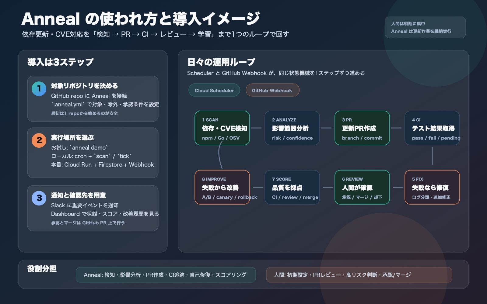

# Anneal — Roadmap

> 目的: Anneal を「デモで伝わるプロトタイプ」から「実リポジトリに入れて継続利用できる DevSecOps エージェント」へ育てる。

Anneal の勝ち筋は、単なる依存更新 Bot ではなく、**PR 作成・CI 修復・評価・自己改善が一つのループとして閉じていること**にある。ロードマップでは、まず実運用に必要な信頼性を固め、その後に導入容易性・拡散性・自己改善の差別化を強める。

---

## 1. 現在地

### できていること

- Go 製の単一バイナリ CLI。
- npm (`package.json`) / Go (`go.mod`) の依存解析。
- OSV / npm registry / Go module proxy によるメタデータ取得。
- update_key による冪等な依存更新レコード管理。
- 状態機械ベースの lifecycle。
- Gemini / GitHub / Slack の gateway 抽象化と mock fallback。
- ローカル JSON store。
- Firestore store。
- デモ用 fixture による scan → PR → CI 失敗 → 修復 → scoring → Annealing Loop。
- GitHub 実モードでの branch / commit / PR 作成。
- GitHub Webhook handler。
- 簡易 dashboard。
- A/B 採用・canary・rollback のドメイン骨格。
- Terraform / CI / image build / Cloud Run deploy の初期構成。

### まだ弱いこと

- Cloud Scheduler による定期 `scan` / `tick` の自動起動が未配線。
- GitHub App としての導入導線がない。
- 対象リポジトリごとの設定 UX が弱い。
- 実運用 KPI を追える dashboard / metrics がまだ薄い。
- Dependabot Alert Webhook や npm / Go 以外の ecosystem は未対応。
- 自己改善は強い差別化だが、最初から前面に出すと説明コストが高い。

---

## 2. ロードマップ全体像

| Phase | 期間目安 | ゴール | 成功条件 |
|---|---:|---|---|
| Phase 0 | 現在〜1週間 | 使われ方と導入導線を明確にする | 初見で demo / local / production の違いが分かる |
| Phase 1 | 2〜3週間 | MVP を継続運用できる | 1 repo で毎日 scan し、人間が review できる PR を出す |
| Phase 2 | 1〜2か月 | チーム導入に耐える | 複数 repo、Webhook、dashboard、通知、設定管理が安定 |
| Phase 3 | 2〜3か月 | 拡散しやすいプロダクトにする | GitHub App / README / demo / quickstart で導入が短い |
| Phase 4 | 3か月〜 | 自己改善を差別化として磨く | スコア改善と rollback を実データで説明できる |

---

## 3. Phase 0: 導入理解 MVP

最優先は「Anneal は何をして、人間は何をすればよいか」を一目で分かる状態にすること。機能が揃っていても、導入手順と日々の使われ方が見えないと試されない。

### Must

- README の上部で「導入3ステップ」と「日々の運用ループ」を図解する。
- `demo` / local polling / Cloud Run production の3モードを明確に分ける。
- 初回導入に必要な環境変数・secret・Webhook URL を一覧化する。
- `.anneal.yml` の最小サンプルを用意する。
- 実 GitHub repo で初回 PR を作るまでの runbook を作る。

### Should

- `anneal doctor` の仕様を決める。
- PR before / after のサンプルを README に載せる。
- 失敗時の代表的な復旧手順を短く書く。

### やらないこと

- 自動マージ。
- 大規模な UI。
- 複数 repo の本格運用。

---

## 4. Phase 1: 運用できる MVP

1 repo に導入して、毎日 scan し、必要な PR を出し、CI 結果を追い、人間が判断できる通知を出す。

### Must

- Cloud Scheduler で `scan` / `tick` / `reconcile` / `improve` / `adopt` を定期実行する。
- Cloud Run / Firestore / Webhook / Secrets の本番 runbook を固める。
- Slack 通知を「判断に必要な情報」に絞る。
- `.anneal.yml` の repo 設定を固める。
  - 対象 ecosystem
  - 除外 package
  - auto PR 許可範囲
  - human approval 条件
  - 通知先

### 成功条件

- 1つの実リポジトリで、1週間連続して scan / PR / CI 追跡が動く。
- 二重 PR が出ない。
- CI 失敗時に on_hold または修復フローへ正しく進む。
- 人間が PR 本文だけで一次判断できる。

---

## 5. Phase 2: チーム導入版

「個人の便利ツール」から「チームが使える運用ツール」にする段階。

### Must

- 複数 repo 対応。
- repo ごとの設定継承。
  - organization default
  - repo `.anneal.yml`
- dashboard の強化。
  - 状態分布
  - PR 成功率
  - CI 失敗率
  - 人間レビュー待ち
  - High / Critical CVE の残数
  - agent version ごとのスコア
- 監査ログ。
  - AI 判断
  - 作成 PR
  - 追加修正
  - human gate 理由
- エラー通知。
  - 認証切れ
  - GitHub API rate limit
  - lock file 更新失敗
  - Webhook 署名失敗

### Should

- dry-run mode。
- PR 作成前 preview。
- package group 更新。
- Dependabot alert 連携。

### 成功条件

- 3〜5 repo を同時に運用できる。
- 失敗時に人間が原因を追える。
- 導入後、依存更新の手作業が減ったことを説明できる。

---

## 6. Phase 3: 拡散しやすいプロダクト化

導入コストを下げ、試した人が他人に紹介しやすい状態を作る。

### Must

- GitHub App 化。
  - repo 選択
  - 最小権限
  - webhook 自動設定
- Quickstart を 10 分以内にする。
- `anneal doctor` を追加する。
  - GitHub token / app 権限
  - webhook secret
  - Slack
  - store
  - GCP / local mode
- サンプル repo と動画向け demo script。
- README の価値訴求を整理する。
  - CVE 対応が速くなる
  - 依存更新 PR の品質が上がる
  - 失敗から agent が改善する

### Should

- Hosted dashboard。
- Slack interactive approval。
- 生成 PR の quality badge。
- Cost estimate 表示。

### 成功条件

- 初見ユーザーが README だけで demo を動かせる。
- GitHub App install から初回 PR までが短い。
- SNS / blog / demo で伝わる一言がある。

推奨メッセージ:

> Anneal is a self-improving dependency update agent. It opens safer PRs, learns from failed CI and review feedback, and gets better over time.

---

## 7. Phase 4: 自己改善を本物の差別化にする

Anneal らしさの核。最初から全自動で強く見せるより、運用データが溜まってから「改善している」と証明できる形にする。

### Must

- agent version と PR / evaluation を必ず紐づける。
- offline A/B で再現可能な指標だけ比較する。
  - 影響分析の妥当性
  - PR 本文品質
  - risk prediction
  - fix plan の妥当性
- 実行依存指標は canary で見る。
  - CI success
  - merge outcome
  - regression
- 劣化時 rollback。
- 改善履歴を dashboard で見せる。

### Should

- repo / ecosystem ごとの agent profile。
- 高リスク更新だけ上位 model へ escalation。
- human review feedback を改善データセット化。

### 成功条件

- 「改善前より CI 成功率が上がった」または「レビュー指摘が減った」を数字で示せる。
- 劣化版を自動 rollback できる。
- 使うほど賢くなるという主張に実データがある。

---

## 8. 優先順位

### P0

1. README / roadmap の導入図解。
2. Cloud Scheduler による定期 `scan` / `tick`。
3. `.anneal.yml` の最小設定とサンプル。
4. 本番 runbook と `anneal doctor` 仕様。
5. dashboard の運用 KPI 強化。

### P1

1. dashboard 強化。
2. Slack 通知改善。
3. Dependabot alert 連携。
4. 複数 repo 対応。
5. dry-run / preview。

### P2

1. GitHub App 化。
2. package group 更新。
3. Slack interactive approval。
4. Hosted dashboard。
5. cost / usage 表示。

### P3

1. 本格 A/B adoption。
2. canary / rollback の高度化。
3. repo 別 agent profile。
4. model routing。

---

## 9. コスト・シンプルさ・拡散性の判断

### コスパ

- まずは low-cost LLM + deterministic rules を維持する。
- LLM は要約・判断補助・改善案に寄せ、依存解析や状態遷移は決定論的にする。
- 高リスク / 低 confidence のみ上位 model へ逃がす設計にする。

### 実装コスト

- 既存の clean architecture と gateway port を崩さない。
- 本番運用の残りは Cloud Scheduler / Pub/Sub / GitHub App に寄せる。
- GitHub App 化は Phase 3 まで待つ。最初は PAT / GitHub Actions secret でもよい。

### シンプルさ

- すべての入口を「対象レコードを1ステップ進める」に収束させる。
- 常駐 worker を作らない。
- store を単一の真実にする。
- 自動マージは後回しにする。

### 論理的な組み合わせ

- scan は候補を作る。
- engine は状態を進める。
- webhook は外部イベントを状態に反映する。
- scoring は結果を測る。
- annealing は改善候補を作る。
- adoption は改善候補を安全に採用する。

この分離を崩さないことが、今後の拡張コストを下げる。

### 拡散容易性

- GitHub App 化。
- 10分 quickstart。
- demo repo。
- PR before / after の見せ方。
- 「CI 失敗から自分で直す」「失敗を学習する」を動画で見せる。

---

## 10. リスクと対策

| リスク | 対策 |
|---|---|
| 誤った修正 PR を出す | human review 前提、high risk gate、dry-run |
| PR 乱立 | update_key、既存 PR 再利用、package grouping |
| CI 失敗を自動修復しすぎる | retry 上限、on_hold、人間レビュー |
| LLM コスト増 | deterministic rules、batch、上位 model escalation 限定 |
| 秘密情報漏洩 | 送信範囲制御、secret scan、最小権限 |
| 導入が面倒 | GitHub App、doctor、quickstart |
| 自己改善が説明しづらい | 最初は PR 品質/CI 成功率/レビュー指摘数で可視化 |

---

## 11. 直近の実装順

1. README / roadmap に導入図を追加。
2. Cloud Scheduler job で `scan` / `tick` / `reconcile` を自動化。
3. `.anneal.yml` schema とサンプルを整理。
4. `anneal doctor` を追加。
5. dashboard を運用 KPI ベースに拡張。
6. Dependabot Alert Webhook を追加。
7. GitHub App 化。
8. A/B adoption を実データで回す。

---

## 12. 目標 KPI

| 指標 | MVP 目標 | Team 目標 |
|---|---:|---:|
| CVE 検知から PR 作成まで | 30分以内 | 10分以内 |
| 自動 PR の CI 成功率 | 60%以上 | 75%以上 |
| 人間修正なし merge 率 | 30%以上 | 50%以上 |
| 平均レビュー指摘数 | 3件以下 | 2件以下 |
| 二重 PR 発生 | 0件 | 0件 |
| high risk 誤判定 | 月1件以下 | 月0〜1件 |
| 導入時間 | 30分以内 | 10分以内 |
